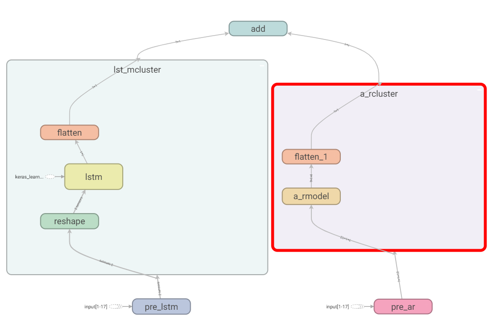
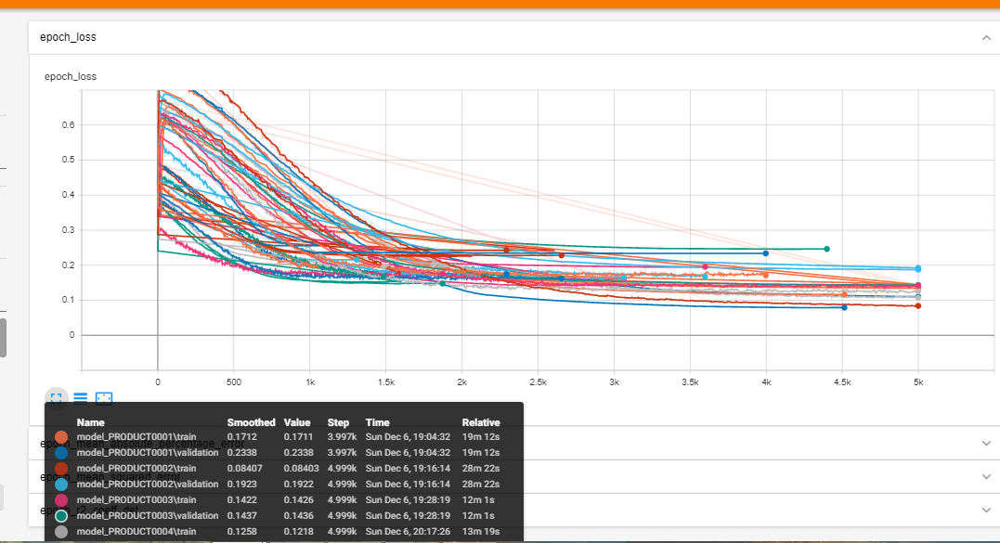

# Forecasting Deep Learning Model

This work is inspired in [LSTNet](https://github.com/fbadine/LSTNet) from 2018. If you want to check the original model, check that up. In this implementation I’d used an autoregressive model in parallel with one cell lstm model.

This work is an adaptation of LSTNet to work with time series for forecasting predictions, this technique provides two effects, the ARmodel provide capability to short term time correlation while the LSTM model help with long term and correlations and no linearities behaviors.

Arquitecture:

Four custom layers were created to preprocesing and create the model.

```python
y1 = prelstm(x)
y1 = LSTMbulk(y1)
y2 = transAR(x)
y2 = ARbulk(y2)
out = addLayer([y1, y2])
model = Model(inputs=x, outputs=out)
```

 <center>
    
</center>

---

## Features:

Class object (forecasting_demanda):

- init

```python
parametros = {"producto":"producto", # name of the product to chose from the db
              "n_steps":12, # step for the time series sample
              "window_agg":3, # windowing for generate agg data rolling mean and rolling std
              "datos_d_interes" : ["Año", "Mes", "Product_Code", "Demand"], # Columnas que tomaremos de la base de datos
              "db_path":"data/DB_Data_Demand.xlsx", # dirección de la base de datos
              "sheetdb" : "DATA", # sheet name inside xlsx file
              "stratif" : 5} # number of group in axis time to estratify and make the split data. train and val
```

Data base format example in file xlsx <br>

| Año  | Mes | Product_Category | Product_Code | Demand |
| :--- | :-- | :--------------- | :----------- | :----- |
| 2012 | 1   | Category_005     | Product_0001 | 97     |
| 2012 | 1   | Category_005     | Product_0002 | 650    |
| 2012 | 1   | Category_005     | Product_0003 | 4      |
| 2012 | 1   | Category_005     | Product_0004 | 3      |
| 2012 | 1   | Category_005     | Product_0007 | 21     |
| 2012 | 1   | Category_005     | Product_0008 | 45     |
| 2012 | 1   | Category_005     | Product_0009 | 2      |
| 2012 | 1   | Category_005     | Product_0010 | 6      |
| 2012 | 1   | Category_005     | Product_0011 | 329    |
| 2012 | 1   | Category_005     | Product_0012 | 760    |

- train_model:<br>
  This method have only one parameter, epochs. This methos already have an entire implementation like:<br>
  -- TensorBoard: store into the folder logs<br>
  -- ModelCheckpoint: store into the folder model<br>
  -- EarlyStopping: after 300 epochs with no improvement, the train will stop<br>
- forecast_product:<br>
  This method do the forecasting to the data that we have. Toke the following parameters.

```python
def forecast_product(self, product_name=None, n_ahead=1, save_path=None):
    ...
```

Ignore the product_name, n_ahead indicate how many step forwards the model going to predict. Save_path indicate if you want to save that result in your machine.

- forecast_valdata<br>
  Return the result of inference the model over the data and val data previosly splited.
- forecast_selfdata<br>
  Return all the inference over the whole data set, sort in time.

## Dataset

- Udemy dummy database: <br>
  was used to train the model, is not the best dataset, event i think is really bad, nothenless is an interesting topic.

## Environment

The work was revelope with the following version:

- Python 3.6.8
- Tensorflow 2.3
- Matplotlib 3.2.2

### Relative Results

We can see the convergence of the model during the training, some products stop before to another, that because the early stop.

 <center>
    
</center>
